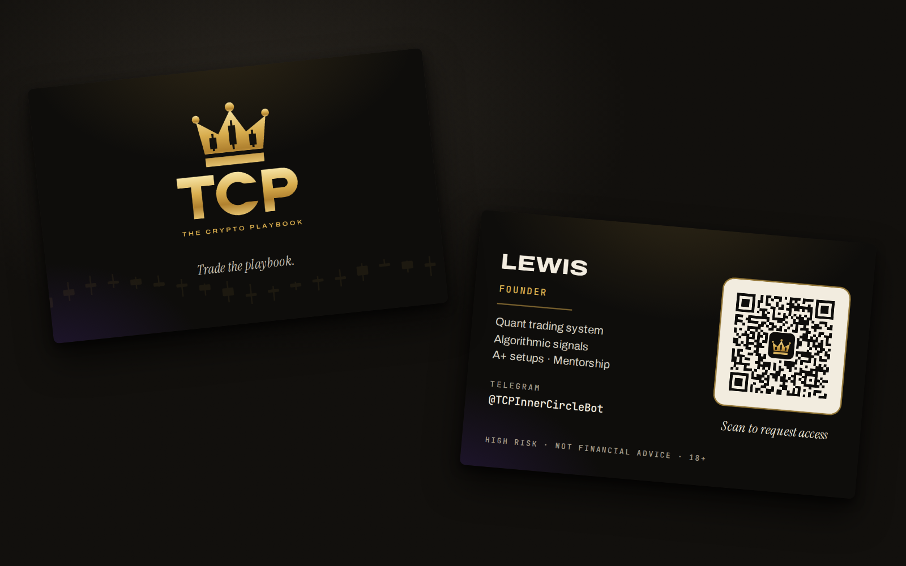

# TCP business cards

Standard UK size, 85 × 55 mm. The front has the official logo, and the back has the name, what TCP
offers, the Telegram handle and a QR code.



## The QR code

It opens the onboarding bot with a tag: `https://t.me/TCPInnerCircleBot?start=card`. Everyone who
scans it arrives in the team group as **Source: card**, so you can see what the cards bring in.
Every build decodes its own QR code from the 300 dpi file, full size and at phone-camera size, and
stops if it doesn't read back the exact link. Still, scan the printer's proof with your phone before
the full run.

## Files for the printer

| File | Use |
|---|---|
| `tcp-card-lewis-print.pdf` | **Upload this.** Two pages (front, back), 91 × 61 mm including 3 mm bleed on every side, vector, fonts embedded. |
| `tcp-card-lewis-front.png`, `-back.png` | The same at 300 dpi (1075 × 720), for printers that ask for images. |
| `tcp-card-lewis-front-trim.png`, `-back-trim.png` | Cut to size, for sending as a digital card (WhatsApp, email, Instagram). |
| `tcp-card-lewis-mockup.png` | Preview. |

Printer settings: 85 × 55 mm, 3 mm bleed already included, no crop marks. The artwork is RGB;
online printers convert it. Heavy stock with a matt or soft-touch finish suits the dark design.
Real gold foil needs a separate foil layer; ask if you want one.

## Cards for the team

Each person can get their own tag, so leads show whose card was scanned:

```
cd brand/business-cards
npm install
node build.js --name SAM --title TEAM --tag card_sam --out tcp-card-sam
```

That writes `tcp-card-sam-print.pdf` and the rest, with the QR set to `?start=card_sam`. Tags can use
letters, digits, `_` and `-` (up to 32 characters).
